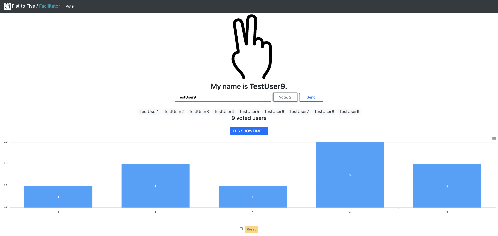

# f3:point_up::v::raised_hand:
Facilitating conversations using Fist to Five.  
Recommended for use in online agile meeting:black_joker:



## Getting Started:rocket:

```zsh
$ yarn install
$ yarn dev
```
### Default port
- frontend: 3000
- backend : 5000

## Lint 

```
$ yarn format
```
`rome check` works internally.
- Dependency verification
- Formatting
- Linting
- package.json validation

※ Not satisfied during development

## Philosophy ⚡
- [Vue 3](https://github.com/vuejs/vue-next)
- [Vite](https://github.com/vitejs/vite)
- [Rome](https://romefrontend.dev/)
- [Bootstrap 5](https://v5.getbootstrap.jp/)
- [Universal JavaScript](https://cdb.reacttraining.com/universal-javascript-4761051b7ae9#.d39eaqcjp)
- [Node.js design patterns](https://github.com/PacktPublishing/Node.js_Design_Patterns_Second_Edition_Code)
  - [en](https://www.amazon.co.jp/Node-Js-Design-Patterns-Mario-Casciaro/dp/1785885588)
  - [ja](https://www.oreilly.co.jp/books/9784873118734/)

## [What is Fist to Five?](https://www.lucidmeetings.com/glossary/fist-five)
> The Fist to Five is a technique for quickly getting feedback or gauging consensus during a meeting. The leader makes a statement, then asks everyone to show their level of agreement with the statement by holding up a number of fingers, from 5 for wild enthusiasm (Jazz hands!) down to a clenched fist for vehement opposition.
